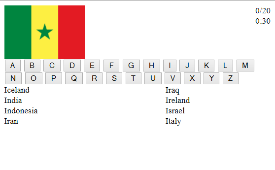

flaggame
========

Simple game where you are shown twenty random flags which you must correctly identify in a given amount of time.
To make it more user friendly I made it a two click interface where you select the first letter of the country name and
then you are shown all the countries beginning with that letter, from which you can select. You only get one selection per flag.
